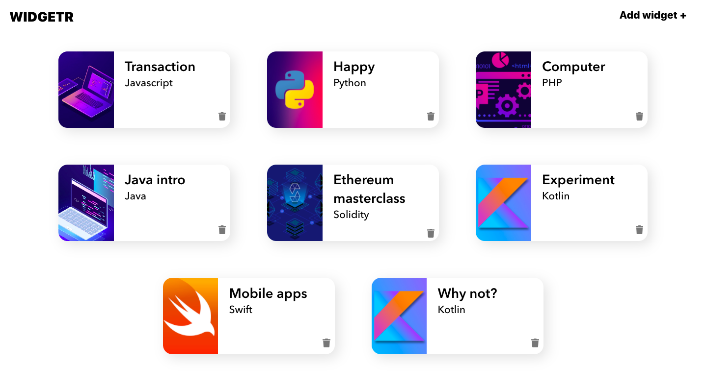

# 

# Table of Content

- [Table of Content](#table-of-content)

  - 1. About the app

  - 2. Libraries & Frameworks

  - 3. Installation & Set Up

## 1. About the app

Widgetr is a simple web application where users can create new widgets that contain a name and a language. Test here https://widgeter-test.vercel.app/

## 2. Libraries & Frameworks

| Name              |                                                    |
| ----------------- | -------------------------------------------------- |
| React             | A JavaScript library for building user interfaces. |
| Styled components | Library for styling                                |

## 3. Installation & Set Up

1. Install project dependencies

```bash
 	npm install
```

2. Start the development server

```bash
	npm start
```

3. Build for production

```bash
 npm run build
```
